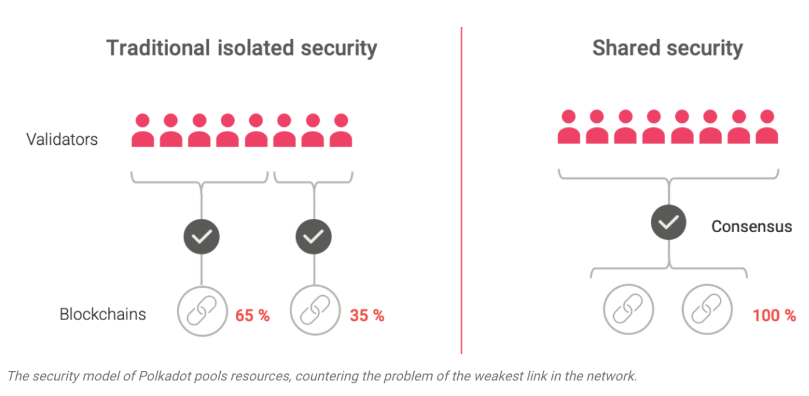

## 인프라 릴레이 체인


**_인프라 릴레이 체인(InfraRelayChain)_** 은 **_인프라 블록스페이스(InfraBlockspace)_** 의 중심으로써 서로 다른 블록체인간 상호 운용성(interoperablitiy)을 통해 확장성(scalability)과 공유된 보안(shared security)를 통한 안정성(security)에 집중한 블록체인 네트워크입니다. **_인프라 릴레이 체인(InfraRelayChain)_** 의 가장 큰 역할은 서로 다른 블록체인이 유기적으로 연결될 수 있도록 하는 것입니다. 따라서 스마트 컨트랙트를 실행하거나 토큰 전송 같은 기본적인 기능들은 패러체인에 위임하여 가장 최소한의 기능(e.g 패러체인 블록 검증)으로 동작할 수 있습니다.

## 파라체인(Parachain)

파라체인(Parachain)은 특정 서비스(e.g DID, STO, 등)에 특화된 블록체인으로써 릴레이 체인에 "병렬적(parallel)"인 "체인(chain)" 에서 이름이 유래되었습니다. 파라체인의 일반적인 형태는 블록체인이지만 그 형태가 꼭 블록체인일 필요는 없습니다(e.g 스마트 컨트랙트). 파라체인은 다음과 같은 특징을 갖고 있습니다:

- 상태 전이 기계(State Transition Machine): 파라체인은 각각의 상태를 가지고 있는 결정적인(deterministic) 상태 기계입니다.

- 콜래이터(Collator): 콜래이터는 파라체인의 여러 트랜잭션들을 모아 블록을 만들고 릴레이 체인 노드에 전달하는 노드입니다. 콜래이터는 파라체인의 풀노드이면서 릴레이 체인의 라이트 노드 역할을 수행합니다.

### 파라체인 상태 전이

각각의 파라체인은 상태를 변경할 수 있는 고유의 로직인 _상태 전이 함수(State Transition Function)_ 을 갖고 있습니다. 이러한 상태 전이 함수는 실행 가능한 웹어셈블리(WASM) 형태로 **_인프라 릴레이 체인_** 에 저장됩니다. **이렇기 때문에 릴레이 체인에 연결된 모든 파라체인은 릴레이 체인 밸리데이터에 의해 검증받게 됩니다.** 

## Proof-of-Validity(PoV)

파라체인은 모든 상태 변화를 블록의 형태로 만들고 정상적으로 상태 변화를 했다는 proof 인 _Proof-of_Validity(PoV)_ 라고 하는 특수한 블록을 전달합니다. 릴레이 체인 밸리데이터는 해당 PoV 를 릴레이 체인에 저장되어있는 각각의 파라체인 상태 전이 함수를 이용하여 블록을 실행한 후 나온 최종 값과 파라체인이 전달한 값을 비교하여 검증합니다. _현재 **_인프라 릴레이 체인(InfraRelayChain)_** 이 전달받을 수 있는 PoV 최대 크기는 5MB 입니다._

```rust
#[derive(codec::Encode, codec::Decode, Clone)]
pub struct ParachainBlockData<B: BlockT> {
	/// The header of the parachain block.
	header: B::Header,
	/// The extrinsics of the parachain block.
	extrinsics: sp_std::vec::Vec<B::Extrinsic>,
	/// The data that is required to emulate the storage accesses executed by all extrinsics.
	storage_proof: sp_trie::CompactProof,
}

type BlockData = Vec<u8>;
pub struct PoV(BlockData);

// Create PoV
let pov = parachain_block_data.encode();
```

#### header
파라체인 블록의 헤더

#### extrinsics
파라체인 블록의 상태 전이 함수

#### storage_proof
상태 전이시 변경되었던 스토리지 목록

## 공유된 보안(Shared Security)



파라체인이 되었을 때 가장 큰 이점은 _공유된 보안(Shared Security)_ 입니다. 각각의 파라체인은 독립적으로 밸리데이터를 구성할 필요없이 릴레이 체인 밸리데이터에 의해 블록 생성과 확정에 대한 안전을 보장받을 수 있습니다. 이로 인해 파라체인은 이러한 민감한 요소들을 신경쓰지 않고 각 서비스에 맞는 비지니스 로직에만 신경쓸 수 있습니다. 


## 파라체인 프로토콜


파라체인(Parachain) 블록 생성부터 릴레이 체인에 포함(Inclusion) 및 확정(Approval)될 때까지 반복적으로 병렬로 수행할 수 있는 프로세스를 목표로 합니다. 이 프로토콜은 강력한 보안을 유지하는 동시에 효율적으로 파라체인이 운영될 수 있도록 합니다. 

파라체인 프로토콜 역할 구분:

- 밸리데이터(Validator): 밸리데이터의 역할은 파라체인으로부터 받은 PoV 를 검증하고 일정 기간동안의 가용성(Availability)를 보장하는 역할을 수행합니다. 
- 콜래이터(Collator): PoV 를 생성하고 밸리데이터에게 전달하는 역할을 수행합니다.

파라체인 프로토콜을 요약하면 크게 두 개의 단계로 구분됩니다:

- **포함 파이프 라인(Inclusion Pipeline)** : 1) 콜래이터들이 보낸 블록들을 2) 밸리데이터들이 검증한 후 3) 정족수 이상의 유효성을 받으면 해당 블록을 4) **_지지(backed)_** 하고 릴레이 체인에 5) **_포함(included)_** 시키는 단계입니다. 하지만 아직 완전히 승인된 것은 아닌 단계입니다(**_pending approval_**)
- **승인 과정(Approval Process)**: Inclusion 단계에 참여하지 않은 랜덤으로 선택된 릴레이 체인 밸리데이터에 의해 검증을 받은 후 해당 파라체인 블록을 최종적으로 승인(**_approved_**)하는 단계입니다.