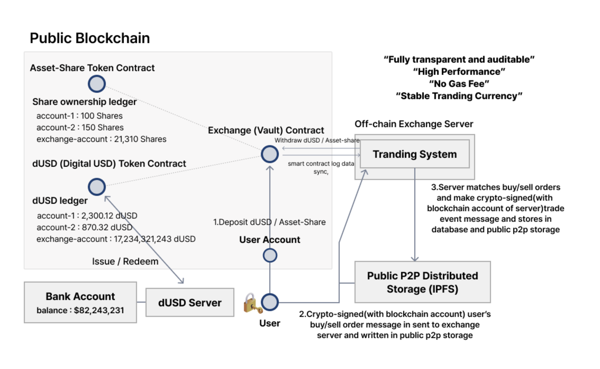
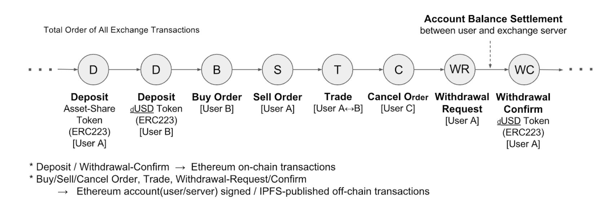

## 온/오프체인 하이브리드 토큰 거래소 시스템

> 대규모 고빈도 거래 처리, 개인정보 보호 및 거래 내역에 대한 투명한 검증과 감사가 가능한 블록체인 기반 토큰 거래소 시스템

토큰 발행과 거래가 모두 블록체인상에서 처리되도록 하는 완전한 탈중앙화 거래소 (DEX) 시스템은 기존 증권거래소나 가상화폐 거래소의 대규모 고속 거래를 실현하기 어렵고, 블록체인 상에 거래내역이 모두 공개가 되는 개인정보 유출의 문제가 있습니다. 인프라 블록체인의 _온/오프체인 하이브리드 토큰 거래소 시스템_ 은 온/오프체인 하이브리드 방식으로 이를 해결합니다:

- 온체인: 토큰 발행, 입출금에 대한 기록과 모든 주문에 대한 내용이 담겨있는 분산 스토리지 주소값울 관리

- 오프체인: 거래 주문(e.g 매수,매도, 주문 취소) 및 체결(e.g 오더 매칭)을 관리

거래소 서버에서 발생하는 거래 주문과 체결 정보는 사용자와 거래소 서버의 블록체인 ID로 전자서명 되고 거래 내역 데이터와 해시값이 위변조 불가한
형태로 ipfs와 같은 분산 스토리지와 블록체인에 저장됩니다. 이를 통해 기존 중앙서버 방식의 거래소 시스템과는 달리 거래소 서버 내 모든 거래 이력 데이터의 무결성을
감사기관이 블록체인을 기반으로 투명하고 정확하게 검증할 수 있도록 합니다.

## 아키텍처

### 거래

#### 매수 오더

#### 매도 오더

#### 트레이딩

#### 주문 취소 오더

#### 예치 요청

#### 인출 요청

#### 인출 취소 요청

#### 인출

### 블록체인 앵커링(Anchoring)

## APOs
 
## Refernces

- [White Paper](https://www.infrablockchain.net/documents/YOSEMITE_Hybrid_Exchange_Technical_White_Paper_20170731a.pdf)