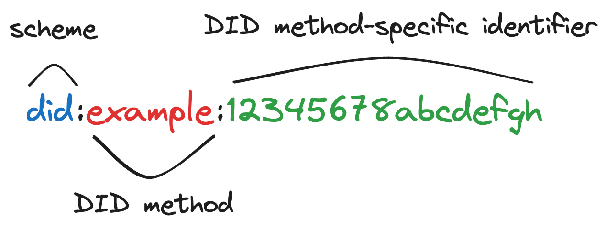
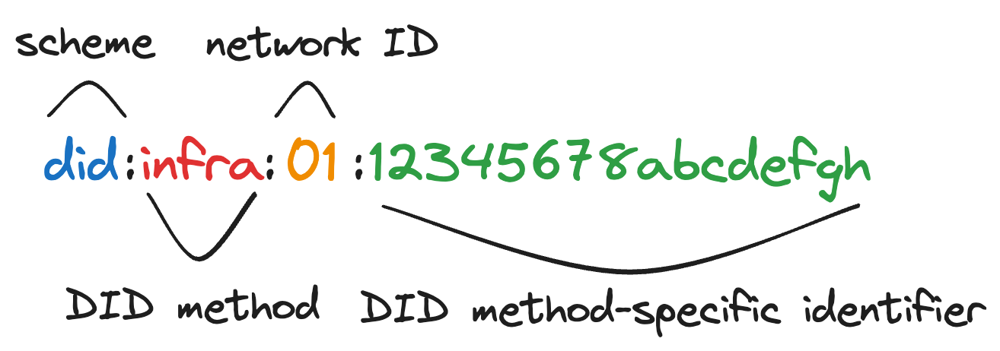
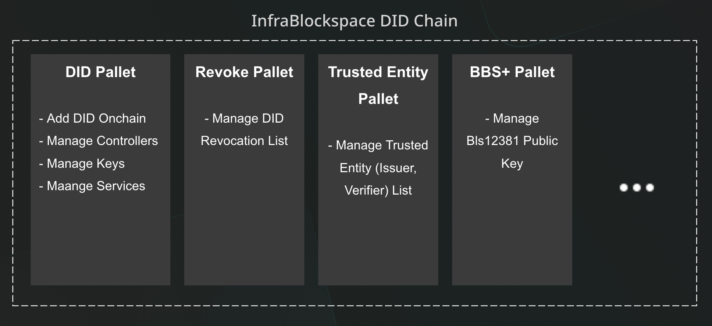
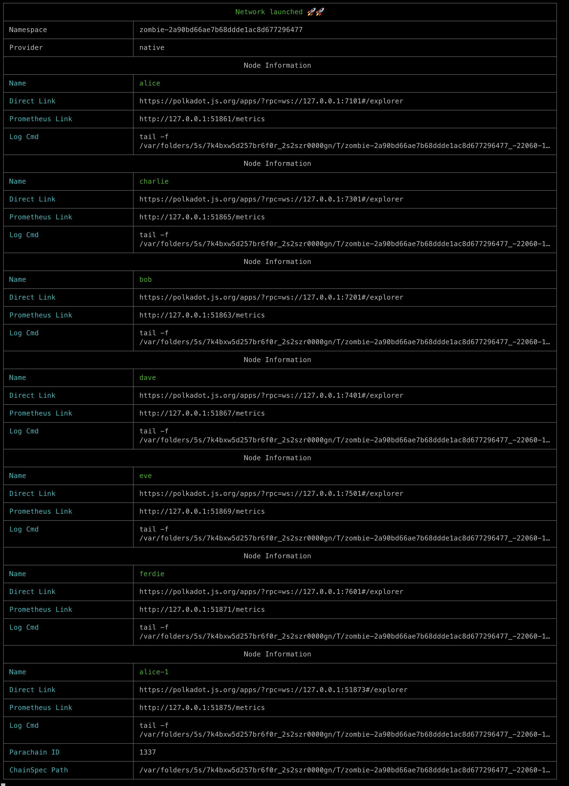

## 시작하기 전에

시작하기 전에 다음을 확인하세요:

<!-- 
  해당 내용이 담긴 문서가 생성되면 그 문서로 링크를 연결 해 주세요
-->

- [로컬 파라체인 구축하기](./infra-did-parachain.md)

- [로컬 릴레이 체인 구축하기](./infra-did-parachain.md)

- [좀비넷 사용하기](./infra-did-parachain.md)

## DID란

**DID**는 Decentralized Identifier의 약자로, 디지털 신원의 주체가 생성, 소유하고 제어하는 새로운 유형의 식별자를 나타냅니다.



DID는 중앙화된 시스템, 권한 또는 중개자와는 독립적으로 완전히 DID 주체의 제어 하에 있습니다. 이 기능은 블록체인 및 분산 원장 기술을 통해 가능하게 됩니다.

DID의 주요 특징 및 이점은 다음과 같습니다:

- 분산화: 중앙화된 시스템이 발행하고 관리하는 기존의 식별자와 달리, DID는 분산 네트워크에서 발행 및 관리됩니다.

- 자기 주권: DID 주체는 자신의 식별자에 대한 전체 제어권을 가지고 있습니다. 어떤 권한의 허락 없이 자신의 DID를 생성, 업데이트 또는 삭제할 수 있습니다.

- 보안: DID는 블록체인 또는 분산 원장 기술에 고착되므로 이러한 플랫폼의 암호학적 보안 속성을 상속받습니다. 또한 DID는 인증 및 통신을 안전하게 유지하기 위해 DPKI (Decentralized Public Key Infrastructure)와 함께 작동합니다.

- 상호 운용성: DID는 다양한 시스템과 네트워크 간에 상호 운용될 수 있도록 설계되었습니다. 즉, 하나의 네트워크에서 생성된 DID는 다른 네트워크에서 사용되고 인식될 수 있습니다.

## Infra DID

인프라 블록스페이스의 파라체인 중 하나인 *Infra DID 파라체인* 은 DID 시스템을 제공하고 있으며 *Infra DID 파라체인* 이 제공하는 DID 를 *Infra DID* 라고 합니다.



*Infra DID 파라체인* 은 기능에 따라 여러가지 팔렛을 포함하고 있습니다.




Infra DID 파라체인과 통신할 수 있는 npm 라이브러리인 [infra-did-js](https://github.com/InfraBlockchain/infra-did-js/tree/main)가 존재합니다. 이를 사용하여 node.js 기반의 시스템에서 Infra DID을 사용할 수 있습니다.


## Infra DID 파라체인

이전 튜토리얼을 완료한 경우 로컬에 *인프라 릴레이 체인* 레포지토리가 있어야 합니다.

1. 컴퓨터의 터미널 셸을 엽니다.

2. 다음 명령을 실행하여 Infra DID 파라체인 저장소를 복제합니다:

   ```bash
   git clone https://github.com/InfraBlockchain/infra-did-substrate
   ```

   이 명령은 `develop` 브랜치를 클론합니다.

3. 다음 명령을 실행하여 노드 템플릿 디렉토리의 루트로 이동합니다:

   ```bash
   cd infra-did-substrate
   ```

   작업을 포함할 새 브랜치를 만듭니다:

   ```bash
   git switch -c my-learning-branch-yyyy-mm-dd
   ```

   `yyyy-mm-dd`를 원하는 식별 정보로 바꾸세요. 숫자로 된 연도-월-일 형식을 권장합니다. 예를 들어:

   ```bash
   git switch -c my-learning-branch-2023-03-01
   ```

4.  다음 명령을 실행하여 노드 템플릿을 컴파일합니다:

   ```bash
   cargo build --release
   ```

   최적화된 빌드를 위해 항상 `--release` 플래그를 사용해야 합니다.
   처음으로 이를 컴파일하는 경우 완료까지 시간이 다소 소요됩니다.

   다음과 유사한 줄이 표시되면 완료됩니다:

   ```bash
   Finished release [optimized] target(s) in 11m 23s
   ```

## 로컬 노드 시작하기

노드가 컴파일되면 좀비넷을 사용하여 릴레이 체인과 Infra DID 파라체인을 로컬 환경에서 구축 할 준비가 되었습니다.

로컬 Infra DID 파라체인을 시작하려면 다음 단계를 따르세요:

1. 좀비넷 설정을 확인합니다

   ```bash
   cat ./zombienet/local-dev.toml
   ```

   ```toml
    [relaychain]
    default_command = "../infra-relay-chain/target/release/infrablockspace"
    default_args = ["-lparachain=debug", "-l=xcm=trace"]
    chain = "infrablockspace-local"

    [[relaychain.nodes]]
    name = "alice"
    validator = true
    rpc_port = 7100
    ws_port = 7101

    [[relaychain.nodes]]
    name = "bob"
    validator = true
    rpc_port = 7200
    ws_port = 7201

    [[relaychain.nodes]]
    name = "charlie"
    validator = true
    rpc_port = 7300
    ws_port = 7301

    [[relaychain.nodes]]
    name = "dave"
    validator = true
    rpc_port = 7400
    ws_port = 7401

    [[relaychain.nodes]]
    name = "eve"
    validator = true
    rpc_port = 7500
    ws_port = 7501

    [[relaychain.nodes]]
    name = "ferdie"
    validator = true
    rpc_port = 7600
    ws_port = 7601

    [[parachains]]
    id = 1337
    chain = "infra-did-substrate-local"
    cumulus_based = true

    # run alice as parachain collator
    [[parachains.collators]]
    name = "alice"
    validator = true
    command = "./target/release/infradid"
    args = ["-lparachain=debug", "--alice"]
   ```

   `relaychain`과 `parachains`의 `default_command` 경로가 실제 로컬에 존재하는 경로와 일치하는지 확인합니다. 

   만약 일치하지 않는다면 로컬 환경에 맞게 변경 해 줍니다.

2. 좀비넷을 실행하여 릴레이 체인과 파라체인을 실행합니다.

    ```shell
    zombienet spawn --provider native zombienet/local-dev.toml
    ```

3. 정상적으로 실행 되었다면 다음과 유사한 터미널 쉘을 확인할 수 있습니다.
  
   

4. (선택) Infra DID 파라체인의 노드를 확인하면 아래와 유사한 로그를 확인할 수 있습니다.

   ```shell
   2023-10-30 14:32:09.155  INFO main sc_cli::runner: Infra DID Node
   2023-10-30 14:32:09.156  INFO main sc_cli::runner: ✌️  version 0.0.1-55dcfcb07e0
   2023-10-30 14:32:09.156  INFO main sc_cli::runner: ❤️  by Cute_Wisp, 2023-2023
   2023-10-30 14:32:09.156  INFO main sc_cli::runner: 📋 Chain specification: Infra DID Local Testnet
   2023-10-30 14:32:09.156  INFO main sc_cli::runner: 🏷  Node name: alice-1
   2023-10-30 14:32:09.156  INFO main sc_cli::runner: 👤 Role: AUTHORITY
   2023-10-30 14:32:09.157  INFO main sc_cli::runner: 💾 Database: RocksDb at /var/folders/5s/7k4bxw5d257br6f0r_2s2szr0000gn/T/zombie-2a90bd66ae7b68ddde1ac8d677296477_-22060-19mFvC1jG2Lx/alice-1/data/chains/local_testnet/db/full
   2023-10-30 14:32:09.157  INFO main sc_cli::runner: ⛓  Native runtime: infra-did-2 (infra-did-0.tx1.au1)
   2023-10-30 14:32:15.620  INFO main infradid::command: Parachain id: Id(1337)
   2023-10-30 14:32:15.620  INFO main infradid::command: Parachain Account: 5Ec4AhNxgS7A2zFSFZP66fwSMZHNTqFNLUXQs6iCDi9fMJMa
   2023-10-30 14:32:15.620  INFO main infradid::command: Parachain genesis state: 0x000000000000000000000000000000000000000000000000000000000000000000fe4694a3e081689168a32207d66b114dffb257f26a008263f8a26a94f30a4b4a03170a2e7597b7b7e3d84c05391d139a62b157e78786d8c082f29dcf4c11131400
   2023-10-30 14:32:15.620  INFO main infradid::command: Is collating: yes
   2023-10-30 14:32:24.276  INFO main sc_service::client::client: [Parachain] 🔨 Initializing Genesis block/state (state: 0xfe46…4b4a, header-hash: 0x3754…6ea8)
   2023-10-30 14:32:24.297 DEBUG main parachain: [Parachain] Restoring chain level monitor from last finalized block: 0 0x3754…6ea8
   2023-10-30 14:32:24.297 DEBUG main parachain: [Parachain] Restored chain level monitor up to height 1
   2023-10-30 14:32:37.472  INFO main sc_service::client::client: [Relaychain] 🔨 Initializing Genesis block/state (state: 0x6854…8371, header-hash: 0x9e0a…2ae2)
   2023-10-30 14:32:37.957 DEBUG main parachain::chain-selection: [Relaychain] Using dispute aware relay-chain selection algorithm
   2023-10-30 14:32:37.964  INFO main grandpa: [Relaychain] 👴 Loading GRANDPA authority set from genesis on what appears to be first startup.
   2023-10-30 14:32:45.464  INFO main babe: [Relaychain] 👶 Creating empty BABE epoch changes on what appears to be first startup.
   2023-10-30 14:32:45.571  INFO main sub-libp2p: [Relaychain] 🏷  Local node identity is: 12D3KooWQz7cbjiQ7ae92R5bpsQXcKFanmjJ5okvVLkyMUpY2Bri
   2023-10-30 14:32:45.615  INFO main sc_sysinfo: [Relaychain] 💻 Operating system: macos
   2023-10-30 14:32:45.615  INFO main sc_sysinfo: [Relaychain] 💻 CPU architecture: aarch64
   2023-10-30 14:32:45.615  INFO main sc_service::builder: [Relaychain] 📦 Highest known block at #0
   2023-10-30 14:32:45.626  INFO main sc_rpc_server: [Relaychain] Running JSON-RPC HTTP server: addr=127.0.0.1:51904, allowed origins=["http://localhost:*", "http://127.0.0.1:*", "https://localhost:*", "https://127.0.0.1:*", "https://polkadot.js.org"]
   2023-10-30 14:32:45.627  INFO main sc_rpc_server: [Relaychain] Running JSON-RPC WS server: addr=127.0.0.1:52049, allowed origins=["http://localhost:*", "http://127.0.0.1:*", "https://localhost:*", "https://127.0.0.1:*", "https://polkadot.js.org"]
   2023-10-30 14:32:45.628  INFO main sc_sysinfo: [Relaychain] 🏁 CPU score: 23.81 MiBs
   2023-10-30 14:32:45.628  INFO main sc_sysinfo: [Relaychain] 🏁 Memory score: 716.52 MiBs
   2023-10-30 14:32:45.628  INFO main sc_sysinfo: [Relaychain] 🏁 Disk score (seq. writes): 1.24 GiBs
   2023-10-30 14:32:45.628  INFO main sc_sysinfo: [Relaychain] 🏁 Disk score (rand. writes): 45.66 MiBs
   2023-10-30 14:32:45.654  INFO tokio-runtime-worker parachain::approval-voting: [Relaychain] Starting with an empty approval vote DB.
   2023-10-30 14:32:45.668  INFO                 main sub-libp2p: [Parachain] 🏷  Local node identity is: 12D3KooWHhaSXEhWFi3LibWRNgF9PezoqB9Xeae4fS3dxCowJEg3
   2023-10-30 14:32:45.677  INFO                 main sc_sysinfo: [Parachain] 💻 Operating system: macos
   2023-10-30 14:32:45.677  INFO                 main sc_sysinfo: [Parachain] 💻 CPU architecture: aarch64
   2023-10-30 14:32:45.677  INFO                 main sc_service::builder: [Parachain] 📦 Highest known block at #0
   2023-10-30 14:32:45.677  INFO tokio-runtime-worker substrate_prometheus_endpoint: [Parachain] 〽️ Prometheus exporter started at 0.0.0.0:51875
   2023-10-30 14:32:45.678  INFO                 main sc_rpc_server: [Parachain] Running JSON-RPC HTTP server: addr=0.0.0.0:51874, allowed origins=["*"]
   2023-10-30 14:32:45.678  INFO                 main sc_rpc_server: [Parachain] Running JSON-RPC WS server: addr=0.0.0.0:51873, allowed origins=["*"]
   2023-10-30 14:32:45.681  INFO                 main sc_sysinfo: [Parachain] 🏁 CPU score: 23.81 MiBs
   2023-10-30 14:32:45.681  INFO                 main sc_sysinfo: [Parachain] 🏁 Memory score: 716.52 MiBs
   2023-10-30 14:32:45.681  INFO                 main sc_sysinfo: [Parachain] 🏁 Disk score (seq. writes): 1.24 GiBs
   2023-10-30 14:32:45.681  INFO                 main sc_sysinfo: [Parachain] 🏁 Disk score (rand. writes): 45.66 MiBs
   2023-10-30 14:32:45.681  WARN                 main infradid::service: [Parachain] ⚠️  The hardware does not meet the minimal requirements for role 'Authority'.
   2023-10-30 14:32:45.691  INFO tokio-runtime-worker libp2p_mdns::behaviour: [Relaychain] discovered: 12D3KooWHhaSXEhWFi3LibWRNgF9PezoqB9Xeae4fS3dxCowJEg3 /ip4/169.254.221.35/tcp/51872/ws
   2023-10-30 14:32:45.691  INFO tokio-runtime-worker libp2p_mdns::behaviour: [Relaychain] discovered: 12D3KooWHhaSXEhWFi3LibWRNgF9PezoqB9Xeae4fS3dxCowJEg3 /ip4/172.16.72.203/tcp/51872/ws
   2023-10-30 14:32:45.691  INFO tokio-runtime-worker libp2p_mdns::behaviour: [Parachain] discovered: 12D3KooWQz7cbjiQ7ae92R5bpsQXcKFanmjJ5okvVLkyMUpY2Bri /ip4/169.254.221.35/tcp/51903/ws
   2023-10-30 14:32:45.691  INFO tokio-runtime-worker libp2p_mdns::behaviour: [Parachain] discovered: 12D3KooWQz7cbjiQ7ae92R5bpsQXcKFanmjJ5okvVLkyMUpY2Bri /ip4/172.16.72.203/tcp/51903/ws
   2023-10-30 14:32:50.551  INFO tokio-runtime-worker babe: [Relaychain] 👶 New epoch 0 launching at block 0x2f30…50e5 (block slot 283107328 >= start slot 283107328).
   2023-10-30 14:32:50.551  INFO tokio-runtime-worker babe: [Relaychain] 👶 Next epoch starts at slot 283107332
   2023-10-30 14:32:50.556  WARN tokio-runtime-worker runtime::inclusion-inherent: [Relaychain] ParentBlockRandomness did not provide entropy
   2023-10-30 14:32:50.560  INFO tokio-runtime-worker substrate: [Relaychain] ✨ Imported #1 (0x2f30…50e5)
   2023-10-30 14:32:50.560  INFO tokio-runtime-worker babe: [Relaychain] 👶 New epoch 0 launching at block 0xae7c…a310 (block slot 283107328 >= start slot 283107328).
   2023-10-30 14:32:50.560  INFO tokio-runtime-worker babe: [Relaychain] 👶 Next epoch starts at slot 283107332
   2023-10-30 14:32:50.561  WARN tokio-runtime-worker runtime::inclusion-inherent: [Relaychain] ParentBlockRandomness did not provide entropy
   2023-10-30 14:32:50.563  INFO tokio-runtime-worker sc_informant: [Relaychain] ♻️  Reorg on #1,0x2f30…50e5 to #1,0xae7c…a310, common ancestor #0,0x9e0a…2ae2
   2023-10-30 14:32:50.563  INFO tokio-runtime-worker substrate: [Relaychain] ✨ Imported #1 (0xae7c…a310)
   2023-10-30 14:32:50.565 DEBUG tokio-runtime-worker parachain::dispute-distribution: [Relaychain] Dispute coordinator slow? We are still waiting for data on next active leaves update.
   2023-10-30 14:32:50.565 DEBUG tokio-runtime-worker parachain::gossip-support: [Relaychain] New session detected session_index=0
   2023-10-30 14:32:50.565 DEBUG tokio-runtime-worker parachain::gossip-support: [Relaychain] Determined past/present/future authorities authority_count=4
   2023-10-30 14:32:50.565 DEBUG tokio-runtime-worker parachain::gossip-support: [Relaychain] Issuing a connection request num=0
   2023-10-30 14:32:50.565 DEBUG tokio-runtime-worker parachain::gossip-support: [Relaychain] error=NotAValidator
   2023-10-30 14:32:50.565 DEBUG tokio-runtime-worker parachain::validator-discovery: [Relaychain] New ConnectToValidators resolved request peer_set=Validation num_peers=0 removed=0
   2023-10-30 14:32:50.566 DEBUG tokio-runtime-worker parachain::approval-voting: [Relaychain] Insta-approving all candidates block_hash=0x2f30c66771f12cb9259fbce326504f470a849bbbc768d4313bf8e4b3b7d350e5
   2023-10-30 14:32:50.566 DEBUG tokio-runtime-worker parachain::approval-voting: [Relaychain] Imported new block. block_number=1 block_hash=0x2f30c66771f12cb9259fbce326504f470a849bbbc768d4313bf8e4b3b7d350e5 num_candidates=0
   2023-10-30 14:32:50.567 DEBUG tokio-runtime-worker parachain::approval-distribution: [Relaychain] Got new blocks [(0x2f30c66771f12cb9259fbce326504f470a849bbbc768d4313bf8e4b3b7d350e5, 1)]
   2023-10-30 14:32:50.567 DEBUG tokio-runtime-worker parachain::approval-distribution: [Relaychain] Got new blocks [(0x2f30c66771f12cb9259fbce326504f470a849bbbc768d4313bf8e4b3b7d350e5, 1)]
   2023-10-30 14:32:50.567 DEBUG tokio-runtime-worker parachain::approval-voting: [Relaychain] Insta-approving all candidates block_hash=0xae7cb455ebc830dac034bad64097b9b21f58f8d82b10c8c5bf29e306c86ba310
   2023-10-30 14:32:50.567 DEBUG tokio-runtime-worker parachain::approval-voting: [Relaychain] Imported new block. block_number=1 block_hash=0xae7cb455ebc830dac034bad64097b9b21f58f8d82b10c8c5bf29e306c86ba310 num_candidates=0
   2023-10-30 14:32:50.567 DEBUG tokio-runtime-worker parachain::approval-distribution: [Relaychain] Got new blocks [(0xae7cb455ebc830dac034bad64097b9b21f58f8d82b10c8c5bf29e306c86ba310, 1)]
   2023-10-30 14:32:50.630  INFO tokio-runtime-worker substrate: [Relaychain] 💤 Idle (5 peers), best: #1 (0xae7c…a310), finalized #0 (0x9e0a…2ae2), ⬇ 10.2kiB/s ⬆ 10.3kiB/s
   2023-10-30 14:32:50.655 DEBUG tokio-runtime-worker parachain::chain-selection: [Relaychain] Prepared 0 stagnant entries for pruning up_to=1698553970 min_ts=0 max_ts=0
   2023-10-30 14:32:50.682  INFO tokio-runtime-worker substrate: [Parachain] 💤 Idle (0 peers), best: #0 (0x3754…6ea8), finalized #0 (0x3754…6ea8), ⬇ 0.8kiB/s ⬆ 0.5kiB/s
   2023-10-30 14:32:54.019  INFO tokio-runtime-worker substrate: [Relaychain] ✨ Imported #2 (0x8170…61f3)
   2023-10-30 14:32:54.021 DEBUG tokio-runtime-worker parachain::infrablockspace-collator-protocol: [Relaychain] Removing relay parent because our view changed. relay_parent=0xae7cb455ebc830dac034bad64097b9b21f58f8d82b10c8c5bf29e306c86ba310
   ```

## 다음 단계로 넘어가기

- [Infra DID 생성하기](../tutorials/parachains/create-infra-did.md)

- [infra-did-js 레포지토리](https://github.com/InfraBlockchain/infra-did-js/tree/main)