이 튜토리얼은 실제로 릴레이 체인(e.g **_InfraRelayChain_** )과 파라체인(e.g **_InfraBlockchain_**) 구조인 멀티체인 환경에서 발행한 토큰을 시스템 토큰으로 등록하고 가스비로 사용하는 방법에 대해 배워보겠습니다.

## 튜토리얼 목표

이 튜토리얼을 완료함으로써 다음 목표를 달성할 수 있습니다:

- 좀비넷을 활용하여 릴레이체인/파라체인 테스트 네트워크를 구축할 수 있습니다.
- 파라체인에서 토큰을 발행하고 릴레이체인에서 해당 토큰을 시스템 토큰으로 등록하기 위한 거버넌스를 발의할 수 있습니다.
- 거버넌스가 통과된 후, 파라체인에서 발행한 시스템 토큰으로 가스비를 낼 수 있습니다.

## 시작하기전에

시작하기 전에 다음을 확인하세요:

- [좀비넷 테스트 네트워크에서 시스템 토큰 사용하기](../../substrate/test/simulate-parachains.ko.md)

## 파라체인에 토큰 생성 및 발행하기

(주의: 파라체인 토큰 생성 및 발행에 필요한 가스비를 위해 테스트 시스템 토큰 혹은 시스템 토큰을 보유하고 있어야 합니다.)

아래와 같이 parachain explorer > Developer > Extrinsic에서 Aseets pallets을 선택하여 asset을 발행하고 민팅합니다.

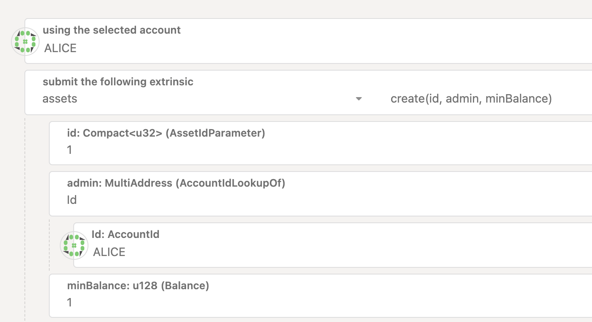

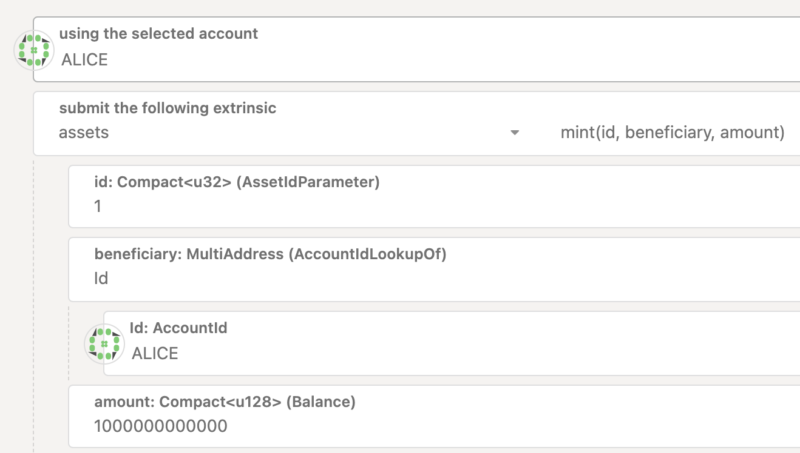

## 릴레이체인에 register_system_token 거버넌스 등록하기

### 거버넌스에 올릴 register_system_token을 위한 preimage 준비

register_system_token을 거버넌스 투표로 올리기 위해 preimage에 먼저 등록을 해야합니다.
Governance > Preimages > Add preimage를 누릅니다.
(preimage는 누구나 등록이 가능합니다.)

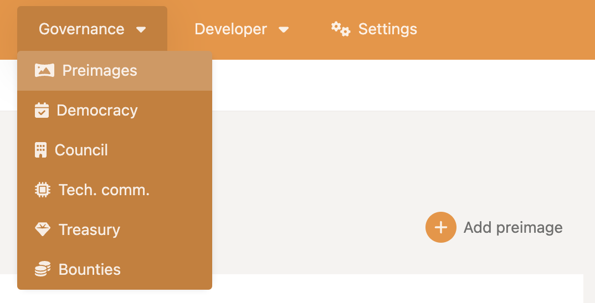

파라체인에서 생성했던 토큰 정보를 토대로 register_system_token에 대한 preimage를 생성합니다.

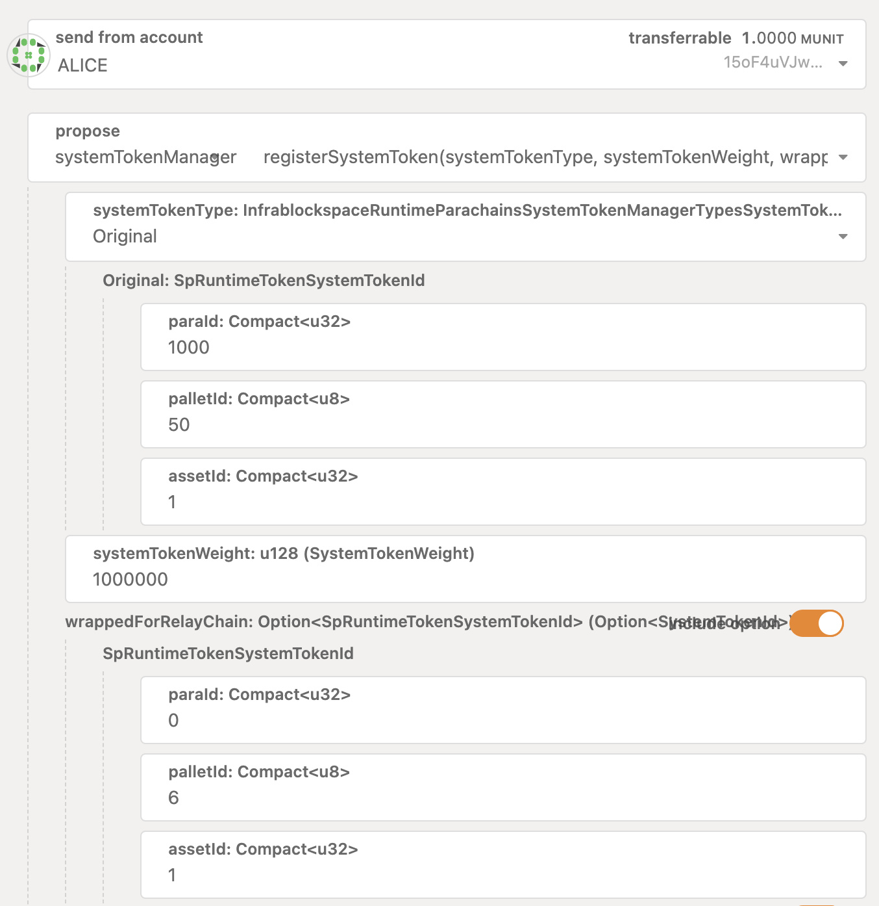

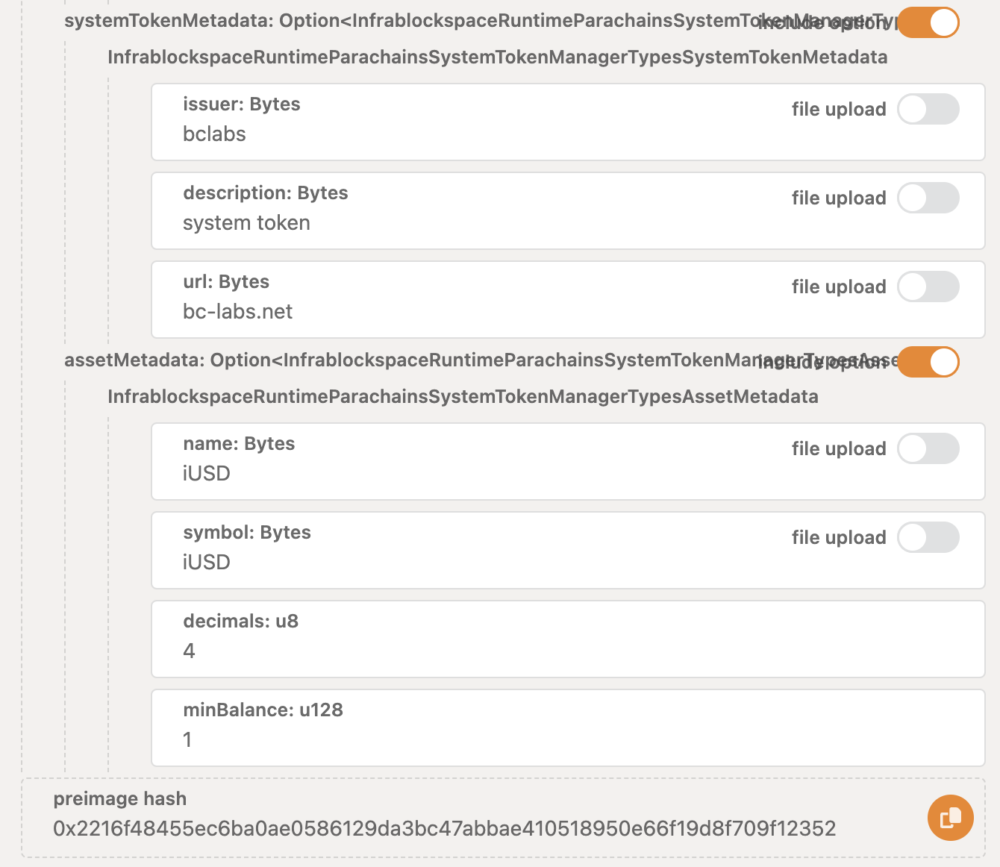

- systemTokenType: Original, para id, asset pallet id, asset id를 알맞게 입력해줍니다.
- systemTokenWeight: 1_000_000(default)로 설정해줍니다.
- wrappedForRelayChain: 시스템 토큰에 대한 wrapped 토큰을 릴레이체인에 바로 등록할 수 있는 옵션입니다.
- systemTokenMetadata: systemtoken에 대한 metadata를 입력합니다.
- assetMetadata: asset에 대한 metadata를 입력합니다.

다음과 같이 hash값과 함께 정상적으로 등록이 됩니다.

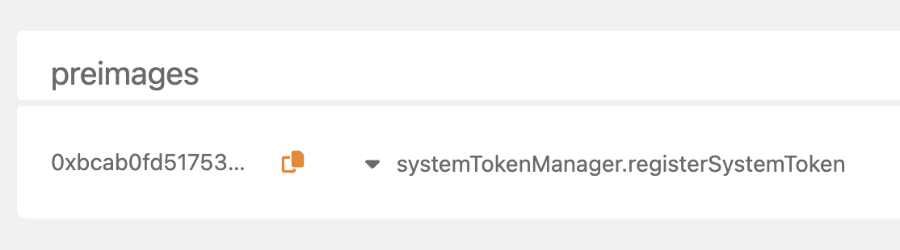

### 등록된 preimage를 governance에 등록

릴레이체인 익스플로러 - Developer - Extrinsic에서,
council pallet의 propose를 통해 1에서 등록했던 preimage에 대한 안건을 council 거버넌스에 올립니다. 
(주의: council propose는 릴레이체인 검증자만 올리고 투표할 수 있습니다.)

- threshold: 안건 투표를 종료하기 위한 투표수
- Legacy-hash: 1에서 등록했던 preimage에 대한 hash
- lengthBound: preimage의 length 제한. 

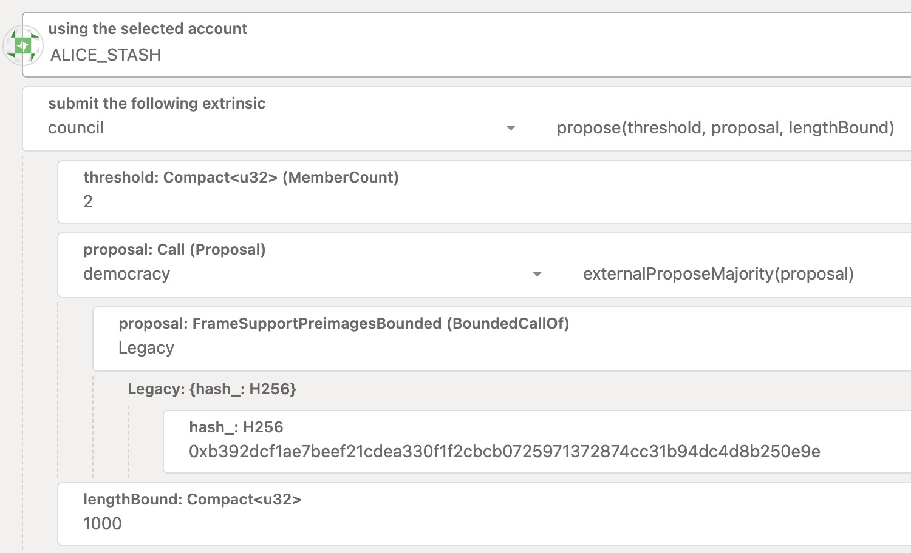

## 거버넌스 통과시키기

거버넌스에 정상적으로 등록됐다면 Governance - Council - Motion에 해당 안건이 아래와 같이 올라와있습니다. 

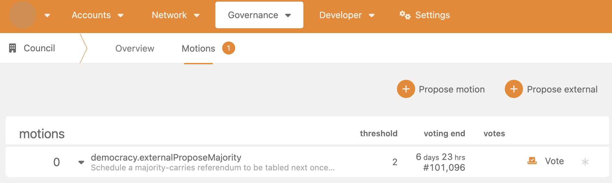

위 화면에서 Vote를 누르고, Council을 구성하는 검증자들(alice_stash, bob_stash)로 투표를 해줍니다.

threshold 인원이상 투표를 했다면 투표를 바로 종료시킬 수 있고, 정족수가 동의(60% 이상)했다면 해당 안건은 바로 집행됩니다.

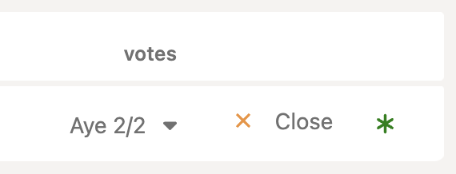

안건이 정상적으로 통과됐고, 파라체인에서도 `sufficient`가 `true`로 바뀐 것을 확인할 수 있습니다.

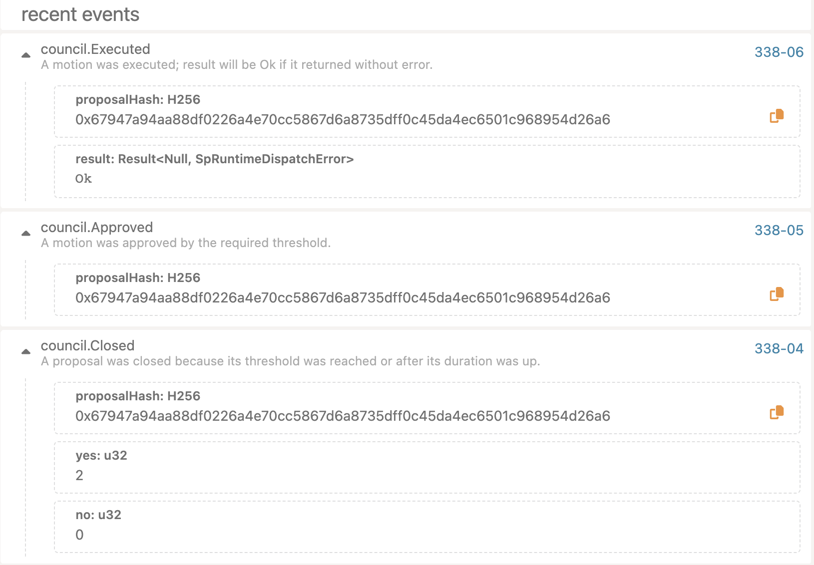

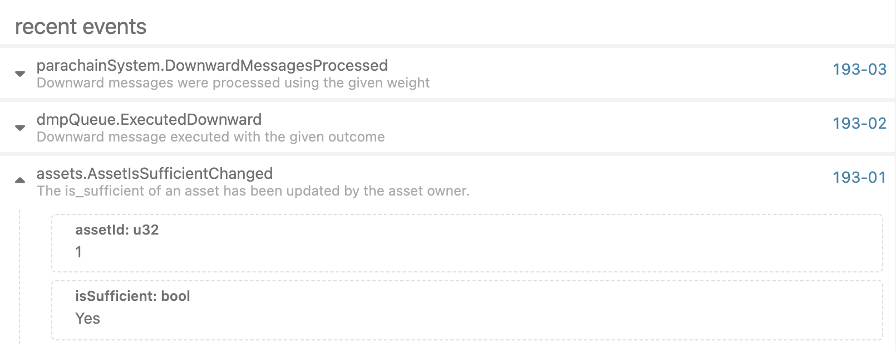

## 시스템 토큰 가스비로 사용하기

이제 파라체인에서는 처음에 발행한 토큰이 시스템 토큰이 되었습니다!

해당 토큰으로 트랜잭션 가스비를 지불할 수 있습니다. 아래처럼 asset transfer call을 해보겠습니다. 

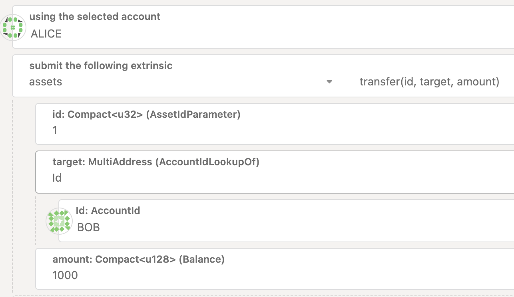

extrinsic extra 정보에서 등록된 시스템 토큰 정보를 입력해줍니다. 

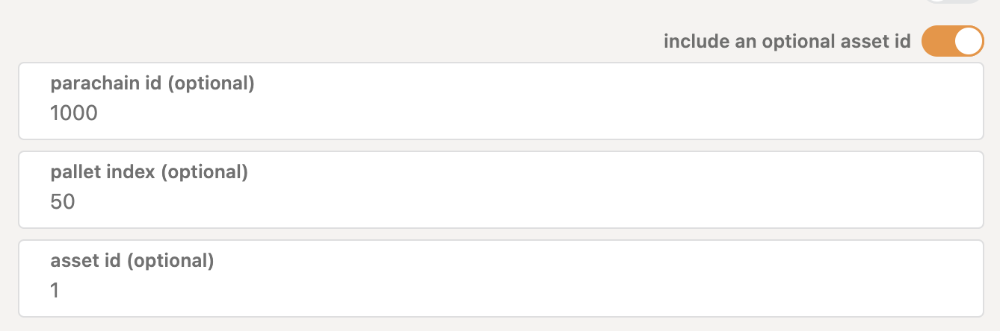

이 시스템 토큰을 활용해 가스비를 낼 수 있는 걸 확인할 수 있습니다.

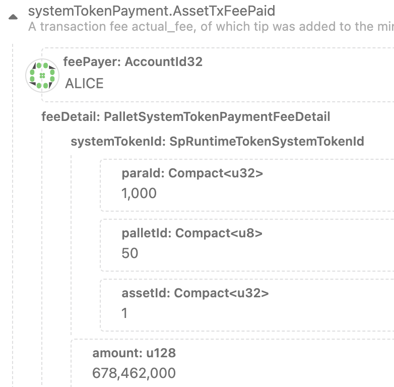