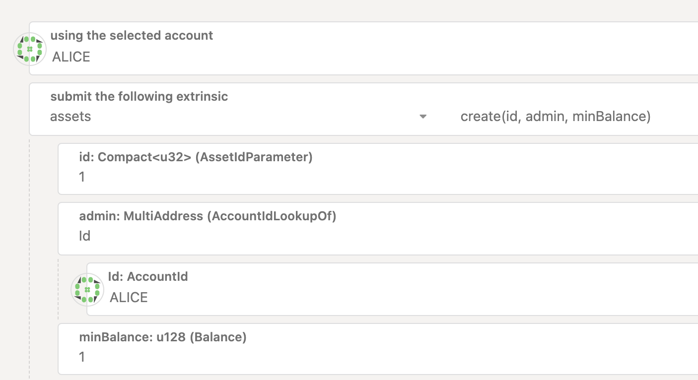
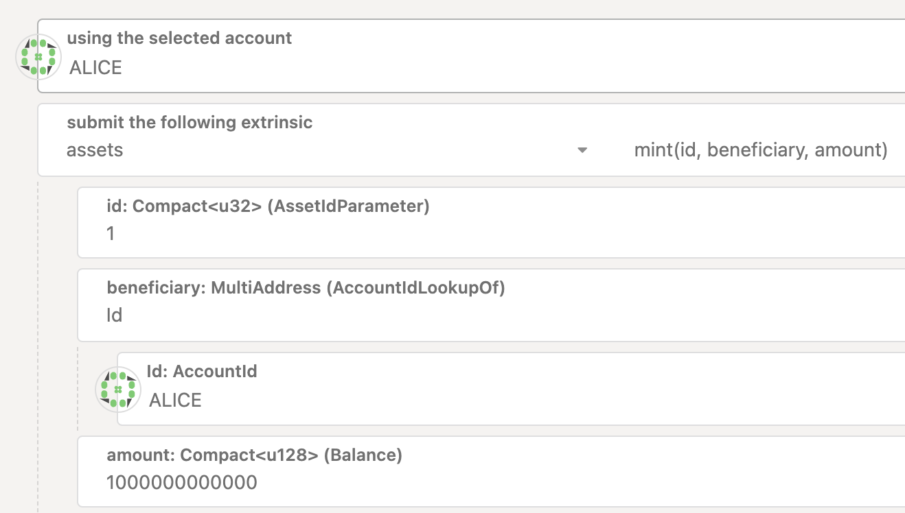

이 튜토리얼은 실제로 릴레이 체인(e.g **_InfraRelayChain_** )과 패러체인(e.g **_InfraBlockchain_**) 구조인 멀티체인 환경에서 발행한 토큰을 시스템 토큰으로 등록하고 가스비로 사용하는 방법에 대해 배워보겠습니다.

## 튜토리얼 목표

이 튜토리얼을 완료함으로써 다음 목표를 달성할 수 있습니다:

- 좀비넷을 활용하여 릴레이체인/파라체인 테스트 네트워크를 구축할 수 있습니다.
- 파라체인에서 토큰을 발행하고 릴레이체인에서 해당 토큰을 시스템 토큰으로 등록하기 위한 거버넌스를 발의할 수 있습니다.
- 거버넌스가 통과된 후, 파라체인에서 발행한 시스템 토큰으로 가스비를 낼 수 있습니다.

## 시작하기전에

시작하기 전에 다음을 확인하세요:

- [로컬 릴레이 체인 준비하기](../../tutorials/build-a-parachain/prepare-a-local-relay-chain.ko.md)

- [로컬 Infra Asset Hub 준비하기]()

- [로컬 패러체인 준비하기](../../tutorials/build-a-parachain/connect-a-local-parachain.ko.md) 

## 1. 파라체인에 토큰 생성 및 발행하기

(주의: 파라체인 토큰 생성 및 발행에 필요한 가스비를 위해 테스트 시스템 토큰 혹은 시스템 토큰을 보유하고 있어야 합니다.)

아래와 같이 parachain에서 asset을 발행하고 민팅한다.

## 2. 릴레이체인에 register_system_token 거버넌스 등록하기

## 3. 거버넌스 통과시키기

## 4. 시스템 토큰 가스비로 사용하기

## 5. (선택) 다른 parachain에서 랩드 시스템 토큰 가스비로 사용하기