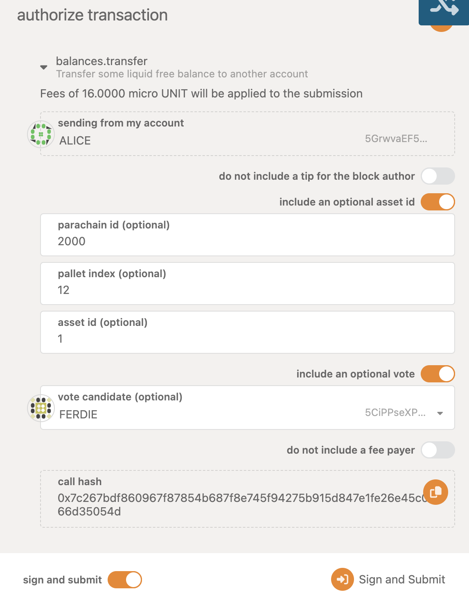
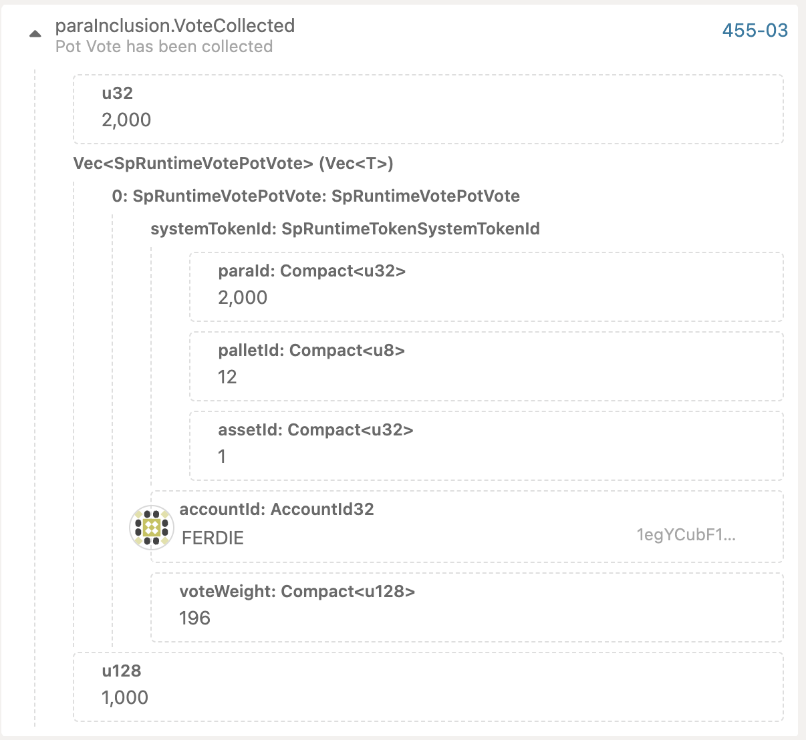

이 튜토리얼은 실제로 릴레이 체인(e.g **_InfraRelayChain_** )과 파라체인(e.g **_InfraBlockchain_**) 구조인 멀티체인 환경에서 [Aggregated TaaV(Transaction-as-a-Vote)](../learn/proof-of-transaction.md)를 이용하여 [PoT(Proof-of-Transaction)](../learn/proof-of-transaction.md) 에 기반한 릴레이 체인의 밸리데이터를 선출하는 방법을 알아 보겠습니다. 

## 튜토리얼 목표

이 튜토리얼을 완료함으로써 다음 목표를 달성할 수 있습니다:

- 좀비넷을 활용하여 릴레이체인/파라체인 테스트 네트워크를 구축할 수 있습니다.
- 시스템 토큰을 이용하여 트랜잭션 수수료를 지불하고 인프라 릴레이체인의 밸리데이터 후보에 투표할 수 있습니다.
- 인프라 릴레이체인의 밸리데이터를 _Seed Trust_ 노드와 _PoT_ 노드로 구성된 것을 확인할 수 있습니다.

## 시작하기 전에

시작하기 전에 다음을 확인하세요:

- [인프라 릴레이 체인 빌드하기](/ko/infrablockchain/tutorials/build-infrablockspace/build-infra-relay-chain.md) 와 [파라체인 빌드하기](../tutorials/build-infrablockspace/build-a-parachain.md) 를 통해 테스트에 사용할 바이너리를 생성하는 방법을 알아보기

- [Proof-of-Transaction](../learn/proof-of-transaction.md) 에 대해 알아보기

- [시스템 토큰](../learn/system-token.md) 으로 트랜잭션 수수료를 내는 방법에 대해 알아보기

## 튜토리얼 단계

해당 튜토리얼은 다음과 같은 순서로 진행될 예정입니다.

- 좀비넷으로 테스트할 환경을 구축합니다. 본 튜토리얼에서는 _Infra Asset Hub_ 와 _Parachain Templete Node_ 두 개의 파라체인을 이용하여 진행할 예정입니다.

- 각 파라체인에서 _시스템 토큰(Sysetm Token)_  을 이용하여 투표할 대상을 포함하여 트랜잭션을 요청합니다.

- **_인프라 릴레이 체인(InfraRelayChain)_** 에서 투표가 수집되는 것을 확인합니다.

- 특정 시점이 지났을 때, Proof-of-Transaction 에 기반한 밸리데이터가 선출되어 블록을 생성하는지 확인합니다.


## 테스트 환경 구축하기

튜토리얼을 위해 사용할 **_인프라 블록스페이스(InfraBlockspace)_** 테스트 환경을 구축합니다. 먼저, 좀비넷 바이너리를 설치합니다. 

- 좀비넷 [깃허브](https://github.com/paritytech/zombienet) 에서 최신 릴리즈 버전을 설치합니다.

- `infrablockspace-sdk/infra-cumulus/zombienet/examples/`  에서 `toml` 을 파일을 만들어줍니다. 여기서는 `example.toml` 을 생성하고 다음과 같이 작성해줍니다. 해당 코드는 다음과 같은 테스트 환경을 구축해줍니다: 
  - 5 개의 밸리데이터 릴레이 체인 노드
  - 2 개의 _infra asset hub_ 콜래이터 노드
  - 2 개의 _parachain template node_ 콜래이터 노드

```toml
[relaychain]
default_command = "{path-to-binary}/infrablockspace"
default_args = ["-lparachain=debug", "-l=xcm=trace"]
chain = "infra-relay-local"

[[relaychain.nodes]]
name = "alice"
validator = true
rpc_port = 7100
ws_port = 7101

[[relaychain.nodes]]
name = "bob"
validator = true
rpc_port = 7200
ws_port = 7201

[[relaychain.nodes]]
name = "charlie"
validator = true
rpc_port = 7300
ws_port = 7301

[[relaychain.nodes]]
name = "dave"
validator = true
rpc_port = 7400
ws_port = 7401

[[relaychain.nodes]]
name = "eve"
validator = true
rpc_port = 7500
ws_port = 7501

[[relaychain.nodes]]
name = "ferdie"
validator = true
rpc_port = 7600
ws_port = 7601

# Asset-Hub
[[parachains]]
id = 1000
chain = "infra-asset-hub-local"
cumulus_based = true

# run alice & bob as parachain collator
[[parachains.collators]]
name = "alice"
validator = true
command = "{path-to-binary}/infra-parachain"
args = ["-lparachain=debug", "-l=xcm=trace"]
rpc_port = 9500
ws_port = 9501

[[parachains.collators]]
name = "bob"
validator = true
command = "{path-to-binary}/infra-parachain"
args = ["-lparachain=debug", "-l=xcm=trace"]
rpc_port = 9510
ws_port = 9511

# Template-node
[[parachains]]
id = 2000
chain = "local"
cumulus_based = true

# run alice & bob as parachain collator
[[parachains.collators]]
name = "alice"
validator = true
command = "{path-to-binary/parachain-template-node}"
args = ["-lparachain=debug", "-l=xcm=trace"]
rpc_port = 9600
ws_port = 9601

# run alice as parachain collator
[[parachains.collators]]
name = "bob"
validator = true
command = "{path-to-binary/parachain-template-node}"
args = ["-lparachain=debug", "-l=xcm=trace"]
rpc_port = 9610
ws_port = 9611

[[hrmp_channels]]
sender = 1000
recipient = 2000
max_capacity = 8
max_message_size = 1048576
[[hrmp_channels]]
sender = 2000
recipient = 1000
max_capacity = 8
max_message_size = 1048576
```

- 터미널에서 좀비넷 명령어를 입력해줍니다.

```bash
# 좀비넷 명령어
./zombienet-macos spawn --provider native ./zombienet/examples/example.toml

# zombinet-macos 명령어가 되지 않을시, 댜음 명령어 입력 후 진행하시기 바랍니다.
chmod +x zombienet-macos
```

## 트랜잭션에 투표 포함 시키기

- 시스템 토큰을 이용해 트랜잭션 수수료를 지불하고 투표를 하기 위해서 먼저 [시스템 토큰 생성하기]() 를 참고하시기 바랍니다. 해당 튜토리얼에서는 `parachain-template-node` 에서 시스템 토큰을 생성했다고 가정하겠습니다.

- [인프라 블록스페이스 익스플로러](https://portal.infrablockspace.net) 로 이동합니다.

- 해당 익스플로러에서는 어떠한 트랜잭션이든 투표를 포함시켜 전송할 수 있습니다. 이번 튜토리얼에서는 `parachain-template-node` 에서 `balance-transfer` 트랜잭션을 전송하는 상황으로 가정하겠습니다.

- `Developer` 섹션에서 `Extrinsics` 탭을 들어갑니다. `balances` 의 `transfer` 를 선택합니다. 트랜잭션에 필요한 값들을 채워 넣은 후 `Submit Transaction` 을 클릭 합니다.

- 트랜잭션의 서브 옵션들 중에 `include an optional asset id` 와 `include an optional vote` 옵션을 켭니다.

  - `asset id` 옵션은 트랜잭션 수수료로 사용할 시스템 토큰을 명시하는 옵션입니다. 

  ```
  - parachain_id: 파라체인 식별자
  - pallet_index: Assets 팔렛 식별자
  - asset_id: 시스템 토큰의 식별자  
  ```
  
  - `vote` 옵션은 PoT(Proof-of-Transaction)으로 선출할 후보자를 지정하는 옵션입니다.

  

- 블록이 처리될 때까지 기다린 후 **_인프라 릴레이 체인(InfraRelayChain)_** 에서 다음과 같은 이벤트를 확인합니다.

  

- 해당 weight 만큼 투표가 집계가 되었고 **_인프라 릴레이 체인(InfraRelayChain)_** 스토리지에서도 확인할 수 있습니다.

  

## 다음 단계로 넘어가기

- [밸리데이터로써 리워드를 받는 방법]()

- [시스템 토큰의 weight]()


