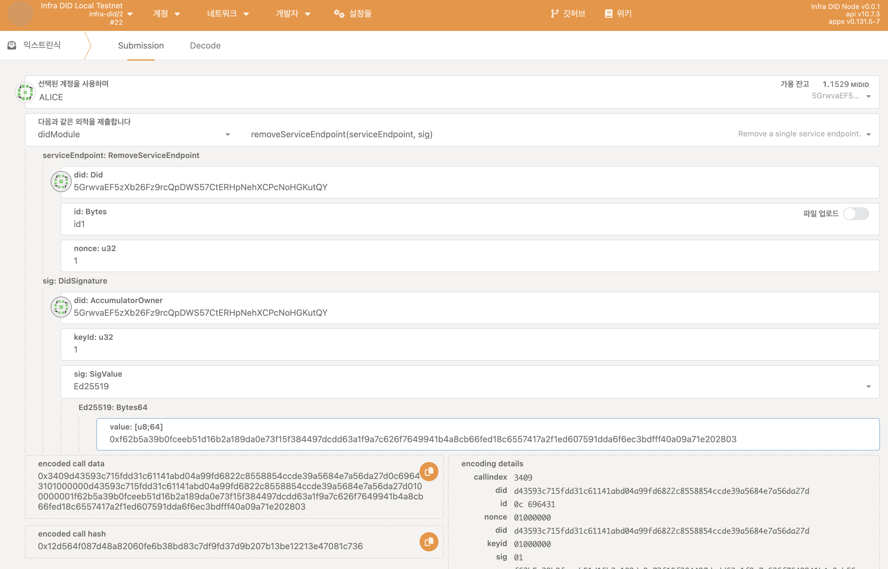
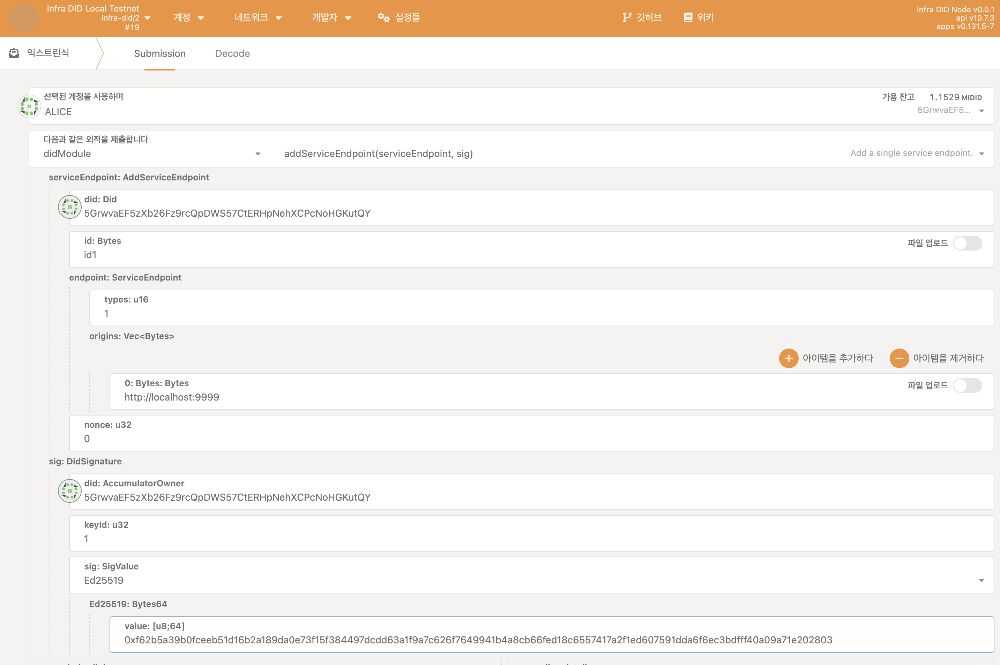

## 시작하기 전에

시작하기 전에 다음을 확인하세요:

- [Infra DID 생성하기](./create-infra-did.md)

## Infra DID에 서비스 엔드포인트 추가하기

특정 DID가 사용할 수 있는 서비스 엔드포인트 목록을 체인에 저장하여 공개함으로써 다른 사용자들이 특정 DID의 Document를 확인하여 알 수 있도록 합니다.

Infra DID에 서비스 엔드포인트를 추가하기 위해선 아래와 같은 과정을 거칩니다.

1. [Portal](https://portal.infrablockspace.net) 에 접속하여 아래 과정을 따릅니다.

  - `개발자` - `익스트린식` - `didModule` 팔레트의 `addServices` 익스트린식을 선택합니다.

    아래와 같이 구성하고 익스트린식을 발생시킵니다. 

    

## Infra DID 서비스 엔드포인트 제거하기

Infra DID에 서비스 엔드포인트 제거하기 위해선 아래와 같은 과정을 거칩니다.

1. [Portal](https://portal.infrablockspace.net) 에 접속하여 아래 과정을 따릅니다.

  - `개발자` - `익스트린식` - `didModule` 팔레트의 `removeServices` 익스트린식을 선택합니다.

    아래와 같이 구성하고 익스트린식을 발생시킵니다. 

    
