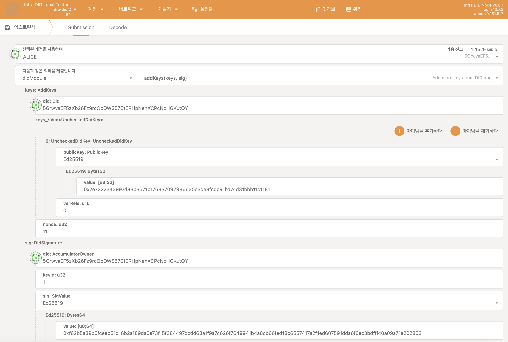
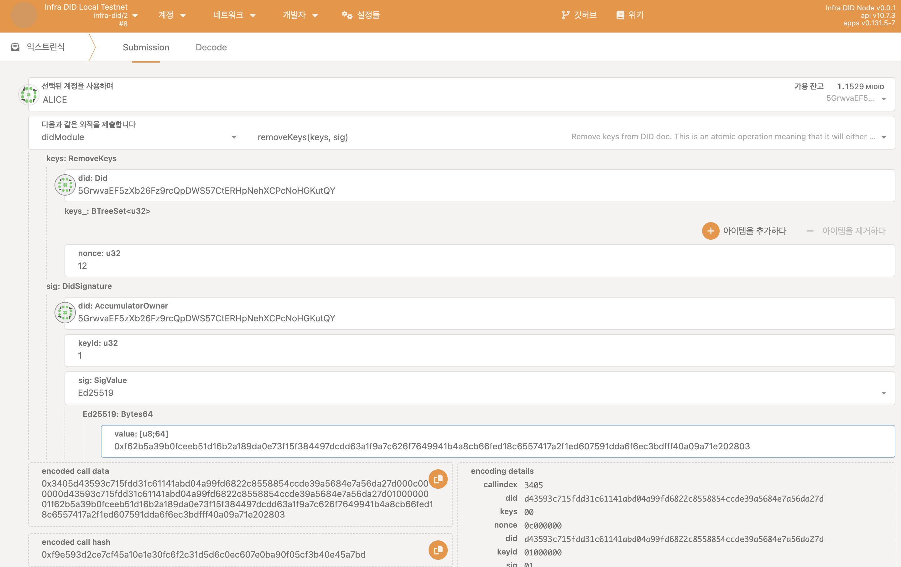

## 시작하기 전에

시작하기 전에 다음을 확인하세요:

- [Infra DID 생성하기](./create-infra-did.md)

## Infra DID에 공개키 추가하기

체인에 등록된 Infra DID는 여러가지 항목들을 관리할 수 있도록 되어있습니다. 그 중 하나는 공개키 목록입니다. 특정 DID가 사용할 수 있는 공개 키 목록을 체인에 저장하여 공개함으로써 다른 사용자들이 특정 DID의 Document를 확인하여 알 수 있도록 합니다.

Infra DID에 공개키를 추가하기 위해선 아래와 같은 과정을 거칩니다.

1. [Portal](https://portal.infrablockspace.net) 에 접속하여 아래 과정을 따릅니다.

  - `개발자` - `익스트린식` - `didModule` 팔레트의 `addKeys` 익스트린식을 선택합니다.

    아래와 같이 구성하고 익스트린식을 발생시킵니다. 

    

    Encode call data: 
    ```shell
    0x3404d43593c715fdd31c61141abd04a99fd6822c8558854ccde39a5684e7a56da27d04012e7222343997d83b3571b176837092986630c3de8fcdc91ba74d31bbb11c1181000000000000d43593c715fdd31c61141abd04a99fd6822c8558854ccde39a5684e7a56da27d0100000001f62b5a39b0fceeb51d16b2a189da0e73f15f384497dcdd63a1f9a7c626f7649941b4a8cb66fed18c6557417a2f1ed607591dda6f6ec3bdfff40a09a71e202803
    ```

## Infra DID 공개키 제거하기

Infra DID에 공개키 제거하기 위해선 아래와 같은 과정을 거칩니다.

1. [Portal](https://portal.infrablockspace.net) 에 접속하여 아래 과정을 따릅니다.

  - `개발자` - `익스트린식` - `didModule` 팔레트의 `removeKeys` 익스트린식을 선택합니다.

    아래와 같이 구성하고 익스트린식을 발생시킵니다. 

    

## 다음 단계로 넘어가기

- [Infra DID에 서비스 엔드포인트 등록하기](./add-services.md)