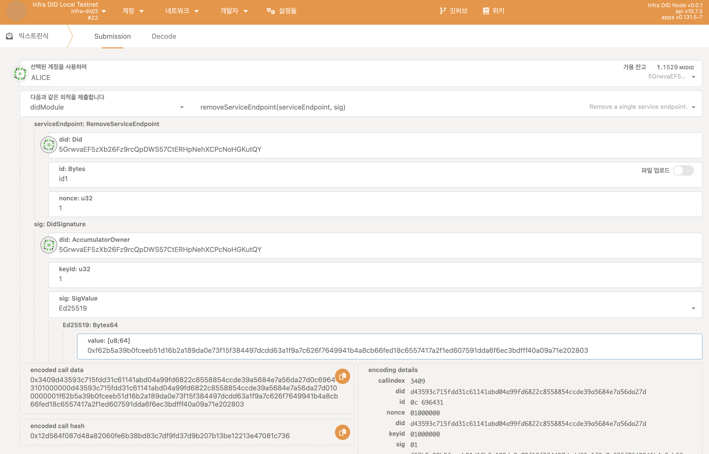
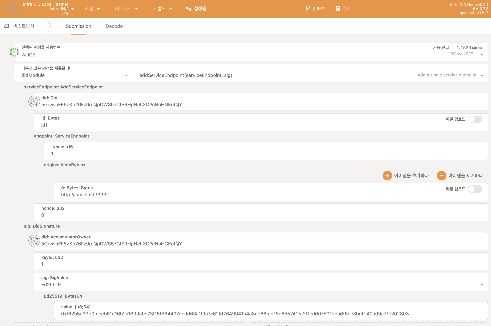

## 시작하기 전에

시작하기 전에 다음을 확인하세요:

- [*InfraDID* 생성하기](./create-infra-did.md)

## *InfraDID* 에 서비스 엔드포인트 추가하기

특정 DID가 사용할 수 있는 서비스 엔드포인트 목록을 체인에 저장하여 공개함으로써 다른 사용자들이 특정 DID의 Document를 확인하여 알 수 있도록 합니다.

*InfraDID* 에 서비스 엔드포인트를 추가하기 위해선 아래와 같은 과정을 거칩니다.

1. [*인프라 블록체인(InfraBlockchain)* 익스플로러](https://portal.infrablockspace.net) 에 접속하여 아래 과정을 따릅니다.

  - `개발자` - `익스트린식` - `didModule` 팔레트의 `addServices` 익스트린식을 선택합니다.

    아래와 같이 구성하고 익스트린식을 발생시킵니다. 

    

## *InfraDID* 서비스 엔드포인트 제거하기

*InfraDID* 에 서비스 엔드포인트 제거하기 위해선 아래와 같은 과정을 거칩니다.

1. [*인프라 블록체인(InfraBlockchain)* 익스플로러](https://portal.infrablockspace.net) 에 접속하여 아래 과정을 따릅니다.

  - `개발자` - `익스트린식` - `didModule` 팔레트의 `removeServices` 익스트린식을 선택합니다.

    아래와 같이 구성하고 익스트린식을 발생시킵니다. 

    

## infra-did-js 라이브러리 사용하여 Infra DID에 서비스 엔드포인트 추가 및 제거하기

`infra-did-js` 라이브러리를 사용해서 Infra DID에 서비스 엔드포인트 추가 및 제거하기

1. [`infra-did-js`](https://github.com/InfraBlockchain/infra-did-js) 라이브러리를 설치합니다.

    ```shell
    yarn add infra-did-js
    ```

2. 아래와 같이 코드를 작성하여 Infra DID 체인에 접근하기 위한 기본 설정 코드를 작성합니다.

    ```typescript
    import  {InfraSS58, CRYPTO_INFO} from 'infra-did-js';

    const txfeePaterAccountKeyPair = await InfraSS58.getKeyPairFromUri('//Alice', 'sr25519');
    const confBlockchainNetwork = {
      networkId: 'space',
      address: 'ws://localhost:9944',
      // seed or keyPair required
      txfeePayerAccountKeyPair,
      // or txfeePayerAccountSeed: 'TX_FEE_PAYER_ACCOUNT_SEED'
    };
    const conf = {
      ...confBlockchainNetwork,
      did: 'did:infra:space:5CRV5zBdAhBALnXiBSWZWjca3rSREBg87GJ6UY9i2A7y1rCs',
      // seed or keyPair required
      seed: 'DID_SEED',
      // keyPair: keyPair,
      controllerDID: 'did:infra:space:5HdJprb8NhaJsGASLBKGQ1bkKkvaZDaK1FxTbJRXNShFuqgY'
      controllerSeed: 'DID_CONTROLLER_SEED',
      // or controllerKeyPair: controllerKeyPair
    };
    const infraApi = await InfraSS58.createAsync(conf);
    ```

3. *InfraDID* 에 서비스 엔드포인트를 추가하기 위한 코드를 작성합니다.

    ```typescript
    // Add Service Endpoint
    /*
    addServiceEndpoint(
      originsTexts: string[],
      endpointType?: ServiceEndpointType,
      endpointIdText?: string,
    )
    */
    await infraApi.didModule.addServiceEndpoint(SOME_SERVICE_ENDPOINT_URLS)
    ```

4. 혹은 *InfraDID* 에 서비스 엔드포인트를 제거하기 위한 코드를 작성합니다.

    ```typescript
    // Remove Service Endpoint
    /*
    removeServiceEndpoint(
      endpointIdText?: string
    )
    */
    await infraApi.didModule.removeServiceEndpoint()
    ```
