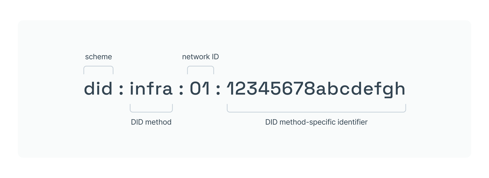
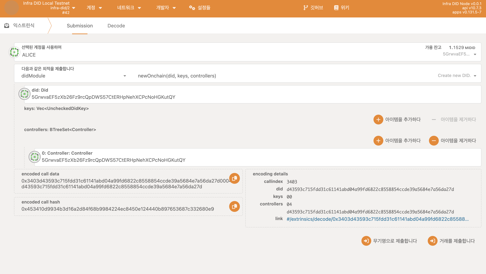
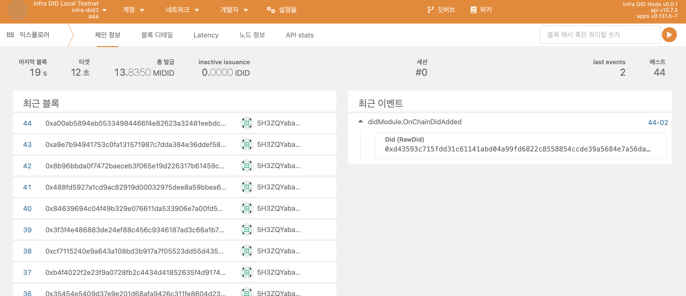
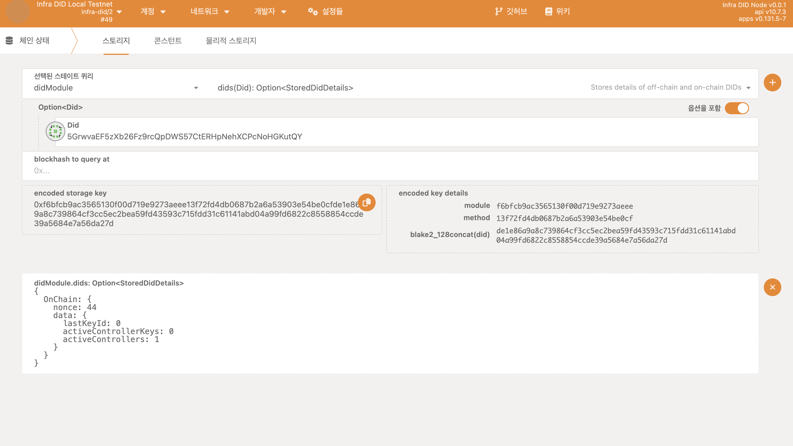

## 시작하기 전에

시작하기 전에 다음을 확인하세요:

- [로컬 Infra DID 파라체인 구축하기](../../../service-chains/infra-did-parachain.md)

## Infra DID 생성하기

Infra DID를 생성하는 것 자체는 블록체인과 통신이 필요하지 않습니다.

Infra DID의 형식은 위 그림에서 `DID method-specific identifier` 부분을 SS58 address로 구성하여 사용하고 있습니다.

즉 `did:infra:{networkID}:{SS58 address}` 형식으로 구성한다면 본인의 DID가 되는것이며 기본적으로 사용할 수 있는 키 쌍은 SS58 address에서 획득할 수 있는 공개키와 그와 쌍을 이루는 개인키를 사용할 수 있습니다.

만약 동일한 DID를 사용하여 여러가지 공개키를 등록하거나 그 외 다른 데이터들을 등록하여 사용하고 싶다면 체인에 DID를 등록하는 과정을 거쳐야 합니다.

## Infra DID 체인에 등록하기

Infra DID를 체인에 등록하기 위해선 아래와 같은 과정을 거칩니다.

1. [Portal](https://portal.infrablockspace.net) 에 접속하여 아래 과정을 따릅니다.

  - `개발자` - `익스트린식` - `didModule` 팔레트의 `newOnchain` 익스트린식을 선택합니다.

    아래와 같이 구성하고 익스트린식을 발생시킵니다. 

    

2. 이벤트를 확인하여 정상적으로 DID가 생성되었는지 확인합니다.

    

3. 스토리지를 조회하여 체인에 정상적으로 DID가 등록되었는지 확인할 수 있습니다.

    

## 다음 단계로 넘어가기

- [Infra DID에 키 추가로 등록하기](./add-keys.md)